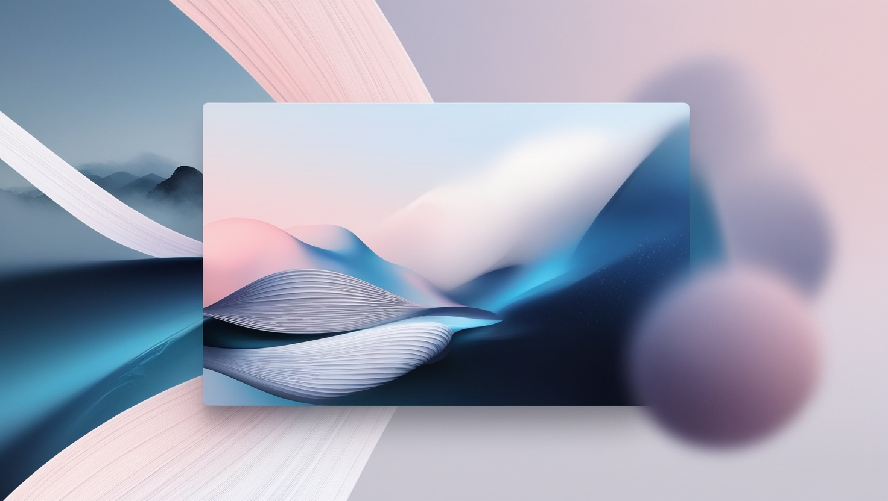

# Gerando Wallpapers com IA!

## 📒 Descrição

Utilizei a [leonardo.ai](https://app.leonardo.ai) para criar wallpapers inspirados no wallpaper do **MacOS**.

## 🤖 Tecnologias Utilizadas

- [Leonardo.AI](https://app.leonardo.ai)

## 🧐 Processo de Criação

1. Utilizei o preset `Minimalist`, com o prompt no `auto` e pedi para ele gerar wallpapers inspirados nos ultimos wallpapers do `macOS`.
2. O resultado está logo abaixo! :)

## 🚧 Resultado

### 1°

---

### 2°

---

### 3°

